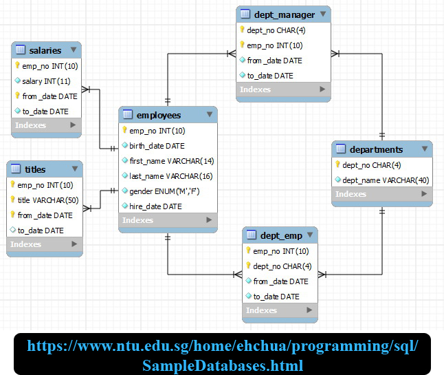
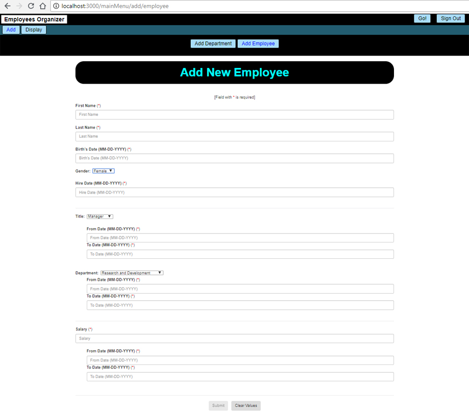
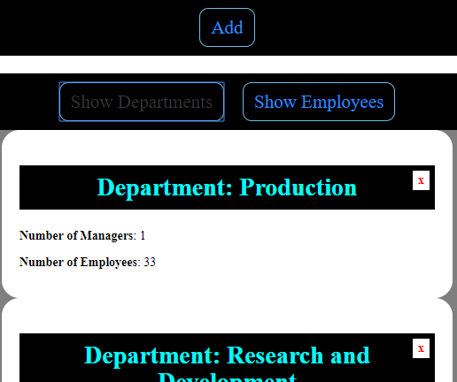
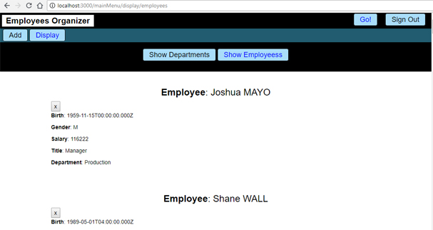

# Employees Organizer

## Aim
>  Managing a company's employees.

---

## Technologies
> * **Front End**: ***React-Redux***
> * **Back End**: ***Express/Node.js*** + ***Sequelize*** (ORM)
> * **Database**: ***mySQL***

## Enhanced Entity-Relationship

---

## User Interfaces
### Add New Employee

### Display All Departments

### Display All Employees

---

## Execution

> 1 - Create a database name '**courses_organizer**' (enter the password of **YOUR** database. Instruction in this file [here](https://github.com/DinhLeGaulois2/sql_react_redux_employees_organizer/blob/master/server/models/index.js)). 
> 2 - Execute (on the application's **root** folder): **npm install** (to install **dependencies**) 
> 3 - Execute (on the application's **root** folder): **npm run build** (to run the **server**) 
> 4 - Open your web browser (***Firefox***, ***Chrome***, etc.) then, enter: **localhost:3000** 

---

## Configuration (VERY IMPORTANT)

At the project's root folder, we have a file name [**server.js**](https://github.com/DinhLeGaulois2/sql_react_redux_employees_organizer/blob/master/server.js), by the end, we have:

It's very important to follow the instruction, otherwise, you could have very disappointed surprises ...

---------------

## Author
* Dinh HUYNH - All Rights Reserved!
* dinh.hu19@yahoo.com